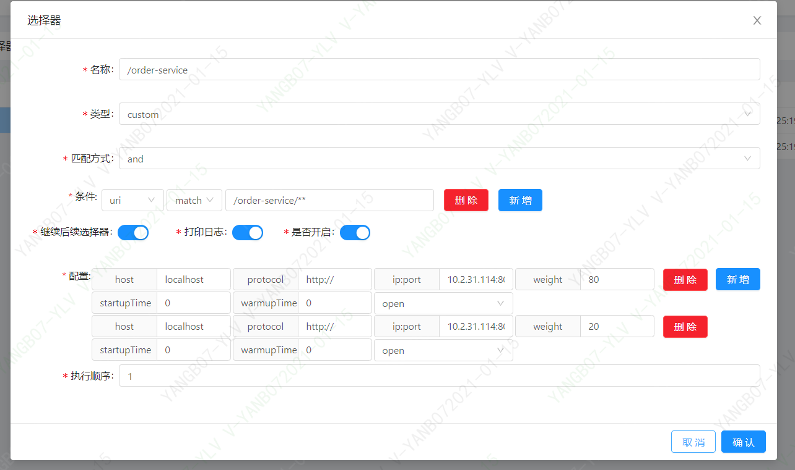

# soul网关转发和springcloud-gateway性能对比

## soul网关转发
接着上篇内容，我们使用springboot接入soul
### 开启步骤
* 启动soul-bootstrap，soul-admin及order-server都在本地起的话，不需要修改配置，直接启动
* 启动两个order-server实例： 8097,8099
> 第一个插件divide，选择器列表:order-serve 点击修改进去，能看到两个实例信息

* post请求地址：http://localhost:9195/order-service/order/gateway，响应body拿到order-servcer返回的数据，说明soul网关转发成功
* 通过soul-bootstrap发起10次请求，如下是order-service业务服务日志，
> 实例8099
```
获得客户端发送请求的完整urlhttp://10.2.31.114:8099/order/gateway
获得客户端发送请求的完整urlhttp://10.2.31.114:8099/order/gateway
获得客户端发送请求的完整urlhttp://10.2.31.114:8099/order/gateway
获得客户端发送请求的完整urlhttp://10.2.31.114:8099/order/gateway
获得客户端发送请求的完整urlhttp://10.2.31.114:8099/order/gateway
```
> 实例8097
```
获得客户端发送请求的完整urlhttp://10.2.31.114:8097/order/gateway
获得客户端发送请求的完整urlhttp://10.2.31.114:8097/order/gateway
获得客户端发送请求的完整urlhttp://10.2.31.114:8097/order/gateway
获得客户端发送请求的完整urlhttp://10.2.31.114:8097/order/gateway
获得客户端发送请求的完整urlhttp://10.2.31.114:8097/order/gateway
```
> 从日志我们发现，均衡的调用到两个实例了，也是说：默认使用轮训的负载均衡策略，目前我们没有配置任何负载均衡策略；

### 修改选择器里面参数startupTime，warmupTime，weight，，我们先修改参数weight，依次 8099:80  8097:20 ，请求10次，我们看下打印日志

> 实例8099
```
获得客户端发送请求的完整urlhttp://10.2.31.114:8099/order/gateway
获得客户端发送请求的完整urlhttp://10.2.31.114:8099/order/gateway
获得客户端发送请求的完整urlhttp://10.2.31.114:8099/order/gateway
获得客户端发送请求的完整urlhttp://10.2.31.114:8099/order/gateway
获得客户端发送请求的完整urlhttp://10.2.31.114:8099/order/gateway
获得客户端发送请求的完整urlhttp://10.2.31.114:8099/order/gateway
获得客户端发送请求的完整urlhttp://10.2.31.114:8099/order/gateway
获得客户端发送请求的完整urlhttp://10.2.31.114:8099/order/gateway
```
> 实例8097
```
获得客户端发送请求的完整urlhttp://10.2.31.114:8097/order/gateway
获得客户端发送请求的完整urlhttp://10.2.31.114:8097/order/gateway
```
> 总结：80%请求到了8099,20%请求到了8087，weight应该是个权重的参数配置项，

> 发现点：之前order-server的配置app-name：sb-demo-api 启动，后面我又kill掉order-server服务，修改app-name：order-server，启动服务后，
过来三四分钟刷新soul-admin页面，选择器列表：sb-demo-api的信息还在，没有剔除掉，先把问题记录，后续跟源码看为什么？

###   如下，我们可以针对某个接口配置各种负载均衡策略，控制颗粒很小，


## soul-bootStrap和springcloud-gateway性能对比
环境：win10 16g   惠普
压测工具：superbenchmarker
启动两个服务：localhost:8098,localhost:8097 ，


### soul-bootStrap 
执行命令
```
C:\Users\v-yanb07>sb -u http://localhost:9195/order-service/order/gateway -c 20  -N 60 -m post
Starting at 2021-01-15 19:55:29
[Press C to stop the test]
39550   (RPS: 552.5)
---------------Finished!----------------
Finished at 2021-01-15 19:56:41 (took 00:01:11.6905437)
Status 200:    39552

RPS: 647.4 (requests/second)
Max: 365ms
Min: 2ms
Avg: 7.4ms

  50%   below 5ms
  60%   below 6ms
  70%   below 8ms
  80%   below 11ms
  90%   below 15ms
  95%   below 19ms
  98%   below 25ms
  99%   below 30ms
99.9%   below 62ms

```

###springcloud-gateway
执行命令
```
C:\Users\v-yanb07>sb -u http://localhost:9527/order/gateway -c 20 -N 60  -m post
Starting at 2021-01-15 19:57:18
[Press C to stop the test]
23718   (RPS: 324.9)
---------------Finished!----------------
Finished at 2021-01-15 19:58:31 (took 00:01:13.2185523)
Status 200:    23725

RPS: 387.6 (requests/second)
Max: 5020ms
Min: 1ms
Avg: 13.1ms

  50%   below 5ms
  60%   below 6ms
  70%   below 8ms
  80%   below 11ms
  90%   below 19ms
  95%   below 29ms
  98%   below 48ms
  99%   below 67ms
99.9%   below 381ms

C:\Users\v-yanb07>

```
### 直连单体一个服务压测
```
C:\Users\v-yanb07>sb -u http://localhost:8098/order/gateway -c 20 -N 60  -m post
Starting at 2021-01-15 19:01:50
[Press C to stop the test]
92836   (RPS: 1355.9)
---------------Finished!----------------
Finished at 2021-01-15 19:02:58 (took 00:01:08.6300207)
Status 200:    92843

RPS: 1518.8 (requests/second)
Max: 160ms
Min: 0ms
Avg: 1.6ms

  50%   below 0ms
  60%   below 1ms
  70%   below 1ms
  80%   below 2ms
  90%   below 5ms
  95%   below 7ms
  98%   below 12ms
  99%   below 17ms
99.9%   below 38ms

C:\Users\v-yanb07>

```
###  压测分析
 * 直连单体的RPS最高，
 * 使用springcloud-gateway的RPS最差，
 * soul-bootstrap性能是springcloud-gateway的1.75倍，明显优于gateway，后需分析为什么性能高于gateway


