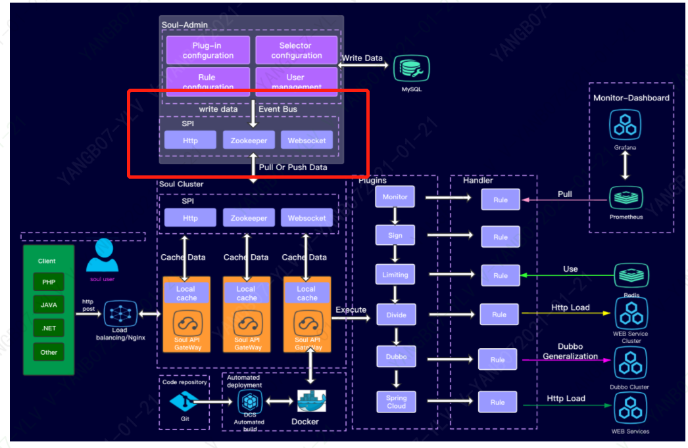
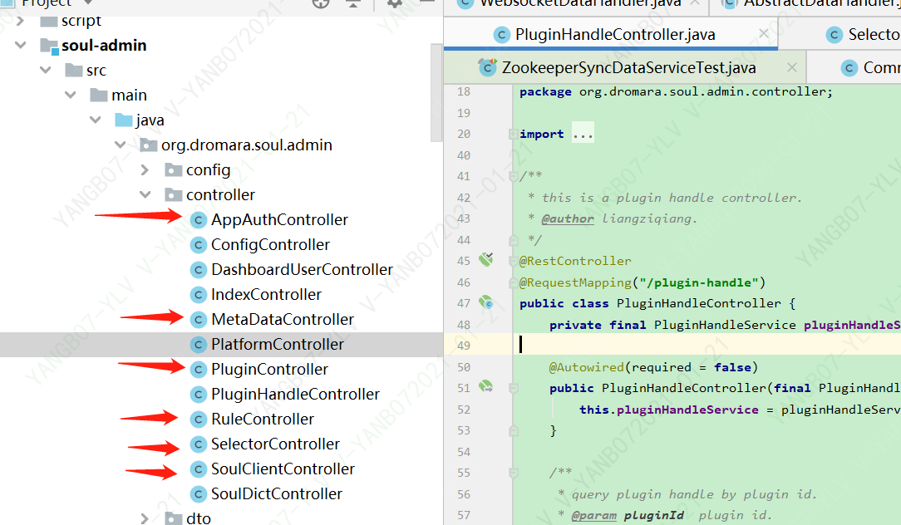
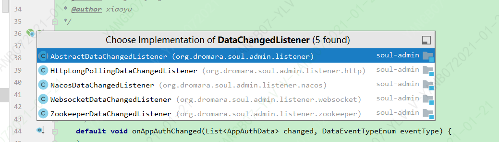

# （七）soul-admin同步使用websocket同步数据到网关源码分析(上)

##  目标
* SoulClientController的内容
* WebsocketDataChangedListener分析

> 分析下图soul框架图中红框的处理逻辑


## SoulClientController的内容

*  1：一共六个接口：springmvc-register，springcloud-register，springcloud-register，dubbo-register，sofa-register，tars-register
    
*  2：六个接口全部用于各个插件通过okhttp方式调用接口：
*  3:处理被代理服务器的注册信息新增到： meta_data表
    
 ``` Java   
            MetaDataDO metaDataDO = MetaDataDO.builder()
                    .appName(dto.getAppName())
                    .path(dto.getContext() + "/**")
                    .pathDesc(dto.getAppName() + "spring cloud meta data info")
                    .serviceName(dto.getAppName())
                    .methodName(dto.getContext())
                    .rpcType(dto.getRpcType())
                    .enabled(dto.isEnabled())
                    .id(UUIDUtils.getInstance().generateShortUuid())
                    .dateCreated(currentTime)
                    .dateUpdated(currentTime)
                    .build();
            metaDataMapper.insert(metaDataDO);

``` 

* 4: 通过发布spring事件


``` Java
       eventPublisher.publishEvent(new DataChangedEvent(ConfigGroupEnum.META_DATA, DataEventTypeEnum.CREATE,
                Collections.singletonList(MetaDataTransfer.INSTANCE.mapToData(metaDataDO))));
``` 
> 如下图：
>MetaDataController、
>PluginController、
>SelectorController、
>RuleController、
>SoulClientController的update和insert之后，
>都会发送一个数据变更事件DataChangedEvent 事件，最终调用publishEvent方法，发布spring事件出去
。


* 5: spring事件监具体处理代码
> APP_AUTH 鉴权,PLUGIN 插件,RULE 规则,META_DATA 元数据都在onApplicationEvent方法接受各自spring事件的监听
  ``` Java  
        public void onApplicationEvent(final DataChangedEvent event) {
            for (DataChangedListener listener : listeners) {
                switch (event.getGroupKey()) {
                    case APP_AUTH:
                        listener.onAppAuthChanged((List<AppAuthData>) event.getSource(), event.getEventType());
                        break;
                    case PLUGIN:
                        listener.onPluginChanged((List<PluginData>) event.getSource(), event.getEventType());
                        break;
                    case RULE:
                        listener.onRuleChanged((List<RuleData>) event.getSource(), event.getEventType());
                        break;
                    case SELECTOR:
                        listener.onSelectorChanged((List<SelectorData>) event.getSource(), event.getEventType());
                        break;
                    case META_DATA:
                        listener.onMetaDataChanged((List<MetaData>) event.getSource(), event.getEventType());
                        break;
                    default:
                        throw new IllegalStateException("Unexpected value: " + event.getGroupKey());
                }
            }
        }

``` 

* 6: 接口DataChangedListener的实现类，有四个，如下图，今天我们分析：WebsocketDataChangedListener
>WebsocketDataChangedListener
>HttpLongPollingDataChangedListener
>NacosDataChangedListener
>ZookeeperDataChangedListener


## WebsocketDataChangedListener分析

* soul-admin 开启websocket,在onApplicationEvent方法处理时就会调到WebsocketDataChangedListener类
``` Java  
soul:
  database:
    dialect: mysql
    init_script: "META-INF/schema.sql"
  sync:
    websocket:
      enabled: true

  ``` 
* WebsocketDataChangedListener类
> 把数据转化为json，通过WebsocketCollector发送出去
>
``` Java  
       WebsocketData<MetaData> configData =
                 new WebsocketData<>(ConfigGroupEnum.META_DATA.name(), eventType.name(), metaDataList);
         WebsocketCollector.send(GsonUtils.getInstance().toJson(configData), eventType);
``` 

##  总结
> 充分使用了Spring的容器内事件发布监听机制： ApplicationEventPublisher发布， WebsocketDataChangedListener监听
> 发布-订阅模式：单一职责原则、代码耦合降低、事件的处理人员只需关注处理的代码、发布人员只需关注发布的代码