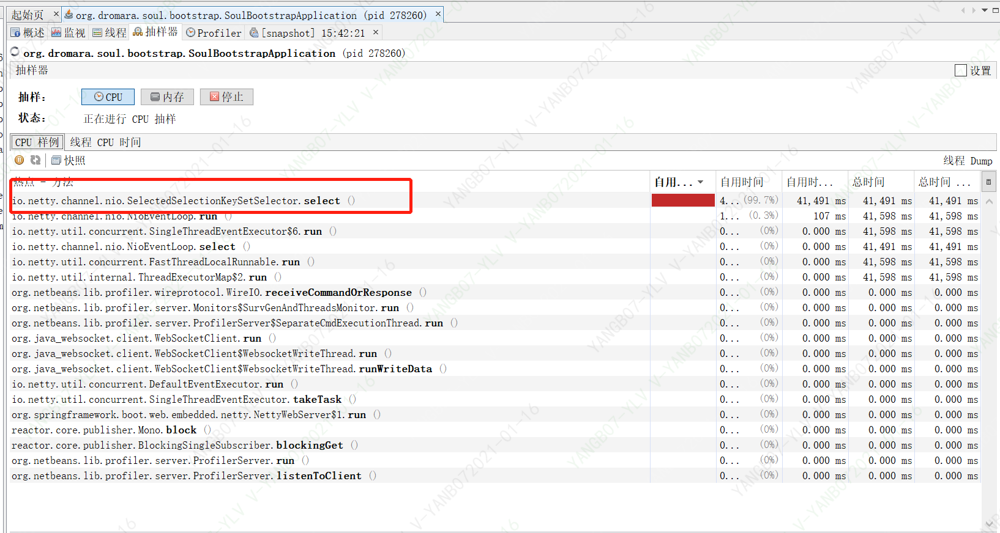
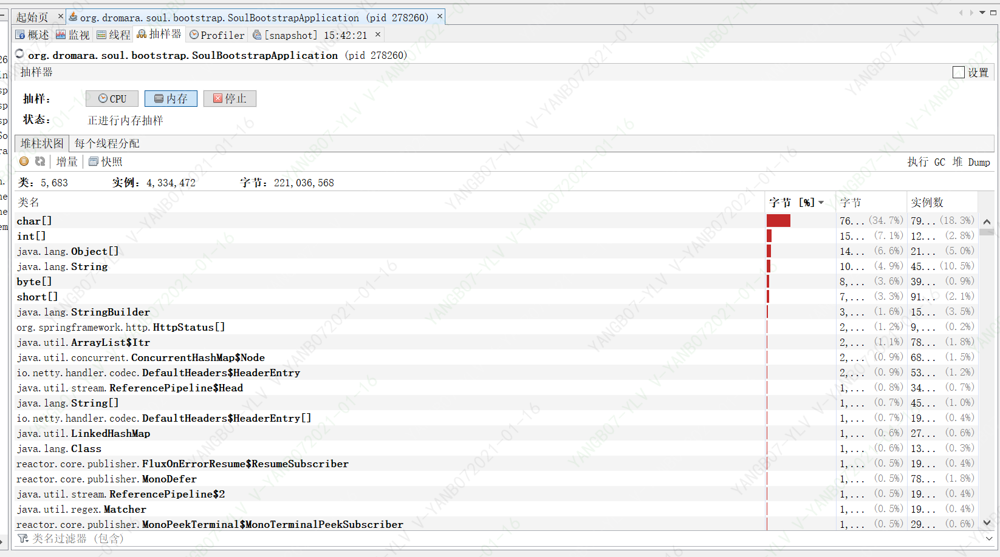
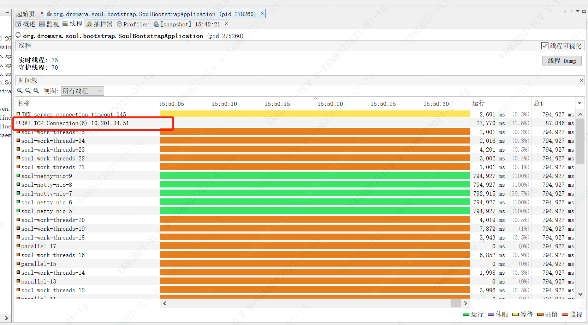
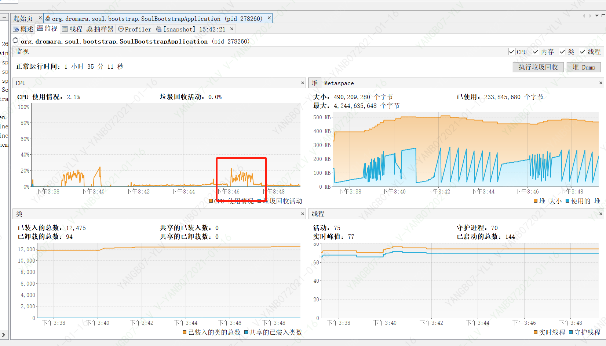

# （三）soul-bootstrap引入springcloud插件使用

##  目标
* 文章主题是如何将springCloud接口，快速接入到soul-bootstrap
* springcloud插件和divide插件压测对比
* springcloud插件压测的jvm数据
* soul-bootstrap日志都配置OFF测试性能


##  在soul-bootstrap的pom.xml添加依赖
* 请在先soul-admin 后台将 springCloud 插件设置为开启
```

 <dependency>
      <groupId>org.dromara</groupId>
      <artifactId>soul-spring-boot-starter-plugin-springcloud</artifactId>
      <version>${project.version}</version>
  </dependency>
  <dependency>
      <groupId>org.springframework.cloud</groupId>
      <artifactId>spring-cloud-commons</artifactId>
      <version>2.2.0.RELEASE</version>
  </dependency>
//ribbon负载均衡
  <dependency>
      <groupId>org.springframework.cloud</groupId>
      <artifactId>spring-cloud-starter-netflix-ribbon</artifactId>
      <version>2.2.0.RELEASE</version>
  </dependency>

```
* 这里我使用eureka作为注册和服务发现
```
//eureka作为注册和服务发现
 <dependency>
     <groupId>org.springframework.cloud</groupId>
     <artifactId>spring-cloud-starter-netflix-eureka-client</artifactId>
     <version>2.2.0.RELEASE</version>
 </dependency>
```
*  在网关的yml文件中 新增如下配置
```
eureka:
  client:
    serviceUrl:
      defaultZone: http://localhost:8761/eureka/
  instance:
    prefer-ip-address: true
```
## 在自己的order-server服务添加依赖，
> order-server自己的一个springcloud项目一个微服务项目
```
 <dependency>
     <groupId>org.dromara</groupId>
     <artifactId>soul-spring-boot-starter-client-springcloud</artifactId>
     <version>2.2.1</version>
 </dependency>
```
* 在你的 controller的接口上加上 @SoulSpringCloudClient 注解
> 在controller添加：@SoulSpringCloudClient(path = "/order/**", desc = "OrderController")，表示当前类的所有接口都会被网关代理

```
    @PostMapping(value = "/gateway")
    @ApiOperation(value = "网关测试")
    //@SoulSpringMvcClient(path = "/order/gateway", desc = "网关测试")
    @SoulSpringCloudClient(path = "/order/gateway", desc = "网关测试")
    public String testGateway(HttpServletRequest request){
        final long start = System.currentTimeMillis();
    //orderService.batchInsertOrser();
        String url = request.getRequestURL().toString();//获得客户端发送请求的完整url
        System.out.println("获得客户端发送请求的完整url"+url);
        return "网关测试";
    }
```
*  yml添加配置整个服务会被网关代理
注意：属性 full 设置true 代表代理你的整个服务，上面的注解@SoulSpringCloudClient就不用加了，false表示代理你其中某几个controller
```
soul:
    springcloud:
      admin-url: http://localhost:9095
      context-path: /order-service
      full: false
  # adminUrl: 为你启动的soul-admin 项目的ip + 端口，注意要加http://
  # contextPath: 为你的这个mvc项目在soul网关的路由前缀， 比如/order ，/product 等等，网关会根据你的这个前缀来进行路由.
  # full: 设置true 代表代理你的整个服务，false表示代理你其中某几个controller
```
* 启动order-service ，端口分别是：8099 8097
> 发起10次请求如下
```
C:\Users\v-yanb07>sb -u  http://localhost:9195/order-servier/order/gateway -n 10  -m post
Starting at 2021-01-16 14:59:53
[Press C to stop the test]
10      (RPS: 14.3)
---------------Finished!----------------
Finished at 2021-01-16 14:59:54 (took 00:00:00.9684487)
Status 200:    10

RPS: 5.4 (requests/second)
Max: 487ms
Min: 11ms
Avg: 61.5ms

  50%   below 12ms
  60%   below 13ms
  70%   below 13ms
  80%   below 34ms
  90%   below 487ms
  95%   below 487ms
  98%   below 487ms
  99%   below 487ms
99.9%   below 487ms
C:\Users\v-yanb07>
```
> 8097服务
```
2021-01-16 14:59:53.569  INFO 279780 --- [0.0-8097-exec-1] o.s.web.servlet.DispatcherServlet        : Initializing Servlet 'dispatcherServlet'
2021-01-16 14:59:53.595  INFO 279780 --- [0.0-8097-exec-1] o.s.web.servlet.DispatcherServlet        : Completed initialization in 25 ms
获得客户端发送请求的完整urlhttp://10.201.34.51:8097/order/gateway
获得客户端发送请求的完整urlhttp://10.201.34.51:8097/order/gateway
获得客户端发送请求的完整urlhttp://10.201.34.51:8097/order/gateway
获得客户端发送请求的完整urlhttp://10.201.34.51:8097/order/gateway
获得客户端发送请求的完整urlhttp://10.201.34.51:8097/order/gateway
```
> 8099服务
```
获得客户端发送请求的完整urlhttp://10.201.34.51:8099/order/gateway
获得客户端发送请求的完整urlhttp://10.201.34.51:8099/order/gateway
获得客户端发送请求的完整urlhttp://10.201.34.51:8099/order/gateway
获得客户端发送请求的完整urlhttp://10.201.34.51:8099/order/gateway
获得客户端发送请求的完整urlhttp://10.201.34.51:8099/order/gateway
```
> 总结：目前我们没有配置任务负载策略，从日志看出我们10次请求都均衡的打到两个服务上去了，分析：soul在使用springcloud插件时默认使用轮训策略
> 同时springcloud选择器没有找到配置某个接口的负载均衡策略


##  springcloud插件和divide插件压测对比

### springcloud插件压测
```
C:\Users\v-yanb07>sb -u http://localhost:9195/order-service/order/gateway -c 20  -N 60 -m post
Starting at 2021-01-16 15:11:04
[Press C to stop the test]
87778   (RPS: 1285.3)
---------------Finished!----------------
Finished at 2021-01-16 15:12:13 (took 00:01:08.4316597)
Status 200:    87778

RPS: 1435.3 (requests/second)
Max: 3372ms
Min: 0ms
Avg: 2.6ms

  50%   below 1ms
  60%   below 1ms
  70%   below 1ms
  80%   below 2ms
  90%   below 5ms
  95%   below 7ms
  98%   below 11ms
  99%   below 15ms
99.9%   below 63ms
C:\Users\v-yanb07>
```
> 上一篇文章(（二）soul网关转发和springcloud-gateway性能对比)的数据divide插件压测的RPS是：647，直连服务压测RPS：1518，本次springcloud的RPS是1435
  springcloud结合eureka的性能明显优于divide插件，和直连服务性能快差不多了，问题记录：为什么springcloud插件优于divide插件，需要去具体的源码分析，
>
## springcloud插件压测的jvm数据
> dos窗口执行 ：jvisualvm  
>打开界面后找到实例：org.dromara.soul.bootstrap.SoulBootstrapApplication
###  soul-抽样器-cpu
> 从图片我们看到io.netty.channel.nio.SelectedSelectionKeySetSelector.select 消耗99.7% 具体还不知道他是干嘛的

>
>###  内存中的对象排序
 
> 图片信息：
> 对象    占内存比
> char    34.7% 
> int     7.1% 
> object  6.6%  
> string  4.9
>
###  线程耗时

> soul-work-threads线程数量最多  
> soul-netty-ni0线程耗时最多  猜想这类线程应该是处理转发请求工作的

###  监视界面


##  soul-bootstrap日志都配置OFF，测试性能
```
C:\Users\v-yanb07>sb -u http://localhost:9195/order-servce/order/gateway -c 20  -N 60 -m post
Starting at 2021-01-16 16:32:48
[Press C to stop the test]
125205  (RPS: 1817.2)
---------------Finished!----------------
Finished at 2021-01-16 16:33:57 (took 00:01:09.0583142)
Status 200:    125205

RPS: 2046.4 (requests/second)
Max: 663ms
Min: 0ms
Avg: 1ms

  50%   below 0ms
  60%   below 0ms
  70%   below 1ms
  80%   below 1ms
  90%   below 2ms
  95%   below 4ms
  98%   below 8ms
  99%   below 11ms
99.9%   below 29ms

C:\Users\v-yanb07>
```
> 此时RPS是2046，二之前INFO模式下RPS才1453，所有日志打印很消耗的时间，用在实战找应该考虑异步打印日志，或者其他方案