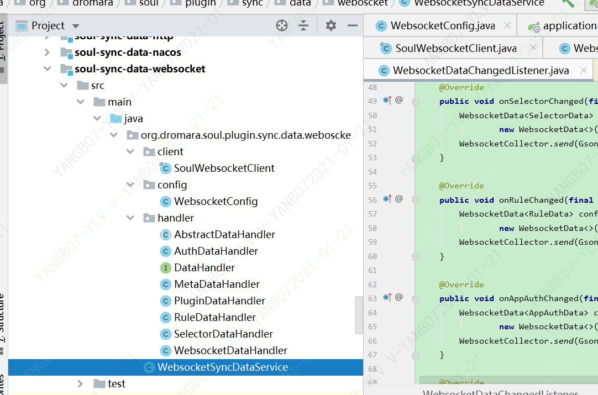
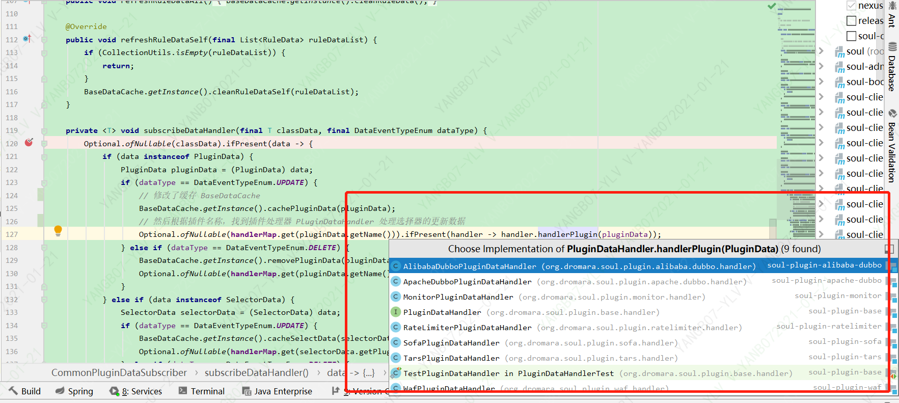

# soul-admin同步使用websocket同步数据到网关源码分析(下).md

##  目标
> 第七小节主要分析了soul-admin通过websocket发送数据
> 本小节主要分析soul-bootstrap怎么处理websocket发来的数据


## soul-sync-data-websocket包
>如下图 


*  SoulWebsocketClient
*  WebsocketConfig
*  DataHandler的实现类和抽象类
*  WebsocketSyncDataService
    
##  websocket接收发来的数据
>交给websocketDataHandler执行

``` Java
    private void handleResult(final String result) {
        WebsocketData websocketData = GsonUtils.getInstance().fromJson(result, WebsocketData.class);
        ConfigGroupEnum groupEnum = ConfigGroupEnum.acquireByName(websocketData.getGroupType());
        String eventType = websocketData.getEventType();
        String json = GsonUtils.getInstance().toJson(websocketData.getData());
        websocketDataHandler.executor(groupEnum, json, eventType);
    }
``` 
## websocketDataHandler  
> 默认的构造函数把DataHandler处理类存在EnumMap对象中
``` Java
    private static final EnumMap<ConfigGroupEnum, DataHandler> ENUM_MAP = new EnumMap<>(ConfigGroupEnum.class);

    /**
     * Instantiates a new Websocket data handler.
     *
     * @param pluginDataSubscriber the plugin data subscriber
     * @param metaDataSubscribers  the meta data subscribers
     * @param authDataSubscribers  the auth data subscribers
     */
    public WebsocketDataHandler(final PluginDataSubscriber pluginDataSubscriber,
                                final List<MetaDataSubscriber> metaDataSubscribers,
                                final List<AuthDataSubscriber> authDataSubscribers) {
        ENUM_MAP.put(ConfigGroupEnum.PLUGIN, new PluginDataHandler(pluginDataSubscriber));
        ENUM_MAP.put(ConfigGroupEnum.SELECTOR, new SelectorDataHandler(pluginDataSubscriber));
        ENUM_MAP.put(ConfigGroupEnum.RULE, new RuleDataHandler(pluginDataSubscriber));
        ENUM_MAP.put(ConfigGroupEnum.APP_AUTH, new AuthDataHandler(authDataSubscribers));
        ENUM_MAP.put(ConfigGroupEnum.META_DATA, new MetaDataHandler(metaDataSubscribers));
    }
 
   //根据type具体哪个模板方法
   public void executor(final ConfigGroupEnum type, final String json, final String eventType) {
        ENUM_MAP.get(type).handle(json, eventType);
    }
``` 

## 使用模板设计模式 AbstractDataHandler类的方法：doRefresh，doUpdate，doDelete
``` Java
    public void handle(final String json, final String eventType) {
        List<T> dataList = convert(json);
        if (CollectionUtils.isNotEmpty(dataList)) {
            DataEventTypeEnum eventTypeEnum = DataEventTypeEnum.acquireByName(eventType);
            switch (eventTypeEnum) {
                case REFRESH:
                case MYSELF:
                    doRefresh(dataList);
                    break;
                case UPDATE:
                case CREATE:
                    doUpdate(dataList);
                    break;
                case DELETE:
                    doDelete(dataList);
                    break;
                default:
                    break;
            }
        }
    }
``` 

## 这里我们分析：doUpdate(dataList)
>SelectorDataHandler
``` Java
    @Override
    protected void doUpdate(final List<SelectorData> dataList) {
        dataList.forEach(pluginDataSubscriber::onSelectorSubscribe);
    }
``` 
> pluginDataSubscriber::onSelectorSubscribe
> CommonPluginDataSubscriber的onSelectorSubscribe

``` Java

  @Override
     public void onSelectorSubscribe(final SelectorData selectorData) {
         subscribeDataHandler(selectorData, DataEventTypeEnum.UPDATE);
     }
``` 
     
> CommonPluginDataSubscriber的subscribeDataHandler  
>  subscribeDataHandler方法是核心： 修改缓存 BaseDataCache： Optional.ofNullable(pluginData).ifPresent(data -> PLUGIN_MAP.put(data.getName(), data));
> 根据插件名称，找到插件处理器 PluginDataHandler 处理选择器的更新数据 

>
>
``` Java

    private <T> void subscribeDataHandler(final T classData, final DataEventTypeEnum dataType) {
        Optional.ofNullable(classData).ifPresent(data -> {
            if (data instanceof PluginData) {
                PluginData pluginData = (PluginData) data;
                if (dataType == DataEventTypeEnum.UPDATE) {
                    // 修改缓存 BaseDataCache： Optional.ofNullable(pluginData).ifPresent(data -> PLUGIN_MAP.put(data.getName(), data));
                    BaseDataCache.getInstance().cachePluginData(pluginData);
                    // 根据插件名称，找到插件处理器 PluginDataHandler 处理选择器的更新数据
                    Optional.ofNullable(handlerMap.get(pluginData.getName())).ifPresent(handler -> handler.handlerPlugin(pluginData));
                } else if (dataType == DataEventTypeEnum.DELETE) {
                    BaseDataCache.getInstance().removePluginData(pluginData);
                    Optional.ofNullable(handlerMap.get(pluginData.getName())).ifPresent(handler -> handler.removePlugin(pluginData));
                }
            } else if (data instanceof SelectorData) {
                SelectorData selectorData = (SelectorData) data;
                if (dataType == DataEventTypeEnum.UPDATE) {
                    BaseDataCache.getInstance().cacheSelectData(selectorData);
                    Optional.ofNullable(handlerMap.get(selectorData.getPluginName())).ifPresent(handler -> handler.handlerSelector(selectorData));
                } else if (dataType == DataEventTypeEnum.DELETE) {
                    BaseDataCache.getInstance().removeSelectData(selectorData);
                    Optional.ofNullable(handlerMap.get(selectorData.getPluginName())).ifPresent(handler -> handler.removeSelector(selectorData));
                }
            } else if (data instanceof RuleData) {
                RuleData ruleData = (RuleData) data;
                if (dataType == DataEventTypeEnum.UPDATE) {
                    BaseDataCache.getInstance().cacheRuleData(ruleData);
                    Optional.ofNullable(handlerMap.get(ruleData.getPluginName())).ifPresent(handler -> handler.handlerRule(ruleData));
                } else if (dataType == DataEventTypeEnum.DELETE) {
                    BaseDataCache.getInstance().removeRuleData(ruleData);
                    Optional.ofNullable(handlerMap.get(ruleData.getPluginName())).ifPresent(handler -> handler.removeRule(ruleData));
                }
            }
        });
    }

``` 