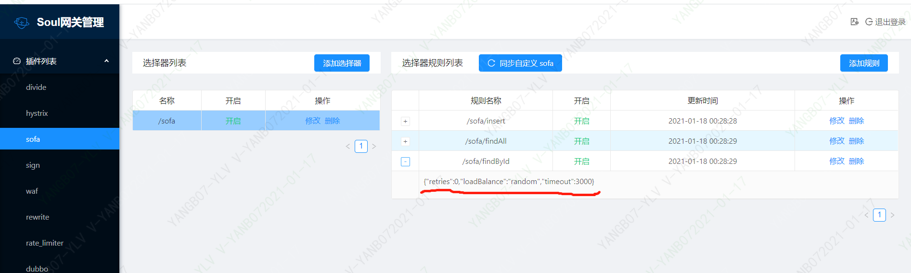

# （四）soul-bootstrap引入sofa插件使用

##  目标
* sofa是什么
* sofa服务接入soul网关
    * soul-bootstrap修改
    * 应用服务引入soul
*  验证网关转发


## sofa是什么
* sofa全称是 Simple Object-oriented and Flexible Architecture
* sofa是蚂蚁金服开源的一个高可扩展性、高性能、生产级的 Java RPC 框架
* sofa-rpc 致力于简化应用之间的 RPC 调用，为应用提供方便透明、稳定高效的点对点远程服务调用方案。为了用户和开发者方便的进行功能扩展，sofa-rpc 提供了丰富的模型抽象和可扩展接口，包括过滤器、路由、负载均衡等等。同时围绕 SOFARPC 框架及其周边组件提供丰富的微服务治理方案
* sofa-rpc提供的dubbo协议最终就是使用的Dubbo的功能（sofa-rpc直接将dubbo的jar引入）


## sofa服务接入soul网关

###  soul-bootstrap修改
* 在 soul-admin --> 插件管理-> sofa 设置为开启。
```
//114.67.171.251是我远程部署的zookeepr，本地部署配置：127.0.0.1
{"protocol":"zookeeper","register":"114.67.171.251:2181"}
```
* soul-bootstrap添加依赖
> 建立在正确的启动 soul-admin下，soul-bootstrap不需要修改配置

```
        <!-- soul sofa plugin start-->
        <dependency>
            <groupId>org.dromara</groupId>
            <artifactId>soul-spring-boot-starter-plugin-resilience4j</artifactId>
            <version>${project.version}</version>
        </dependency>
        <dependency>
            <groupId>com.alipay.sofa</groupId>
            <artifactId>sofa-rpc-all</artifactId>
            <version>5.7.6</version>
        </dependency>
        <dependency>
            <groupId>org.apache.curator</groupId>
            <artifactId>curator-client</artifactId>
            <version>4.0.1</version>
        </dependency>
        <dependency>
            <groupId>org.apache.curator</groupId>
            <artifactId>curator-framework</artifactId>
            <version>4.0.1</version>
        </dependency>
        <dependency>
            <groupId>org.apache.curator</groupId>
            <artifactId>curator-recipes</artifactId>
            <version>4.0.1</version>
        </dependency>
        <dependency>
            <groupId>org.dromara</groupId>
            <artifactId>soul-spring-boot-starter-plugin-sofa</artifactId>
            <version>${project.version}</version>
        </dependency>
        <!-- soul sofa plugin end-->

```
* 重启网关服务

### 应用服务引入soul

* springboot（应用服务）引入依赖
```
    <dependency>
           <groupId>org.dromara</groupId>
           <artifactId>soul-spring-boot-starter-client-sofa</artifactId>
           <version>${soul.version}</version>
       </dependency>
```

* 应用服务添加配置
```
soul:
 sofa:
   adminUrl: http://localhost:9095
   contextPath: /sofa
   appName: sofa
# adminUrl: 为你启动的soul-admin 项目的ip + 端口，注意要加 http://
# contextPath: 为你的这个项目在soul网关的路由前缀， 比如/order ，/product 等等，网关会根据你的这个前缀来进行路由.
# appName：你的应用名称，不配置的话，会默认取sofa配置中application 中的名称

```
* sofa服务实现类的，方法上加上 @SoulSofaClient 注解
* 启动sofa服务，看到日志：sofa client register success，表示sofa接口已经发布到 soul网关
>
```
2021-01-18 00:28:28.771  INFO 382904 --- [ain-EventThread] o.a.c.f.state.ConnectionStateManager     : State change: CONNECTED
2021-01-18 00:28:28.831  INFO 382904 --- [           main] o.d.s.e.s.service.TestSofaApplication    : Started TestSofaApplication in 6.182 seconds (JVM running for 7.996)
2021-01-18 00:28:28.972  INFO 382904 --- [pool-1-thread-1] o.d.s.client.common.utils.RegisterUtils  : sofa client register success: {"appName":"sofa","contextPath":"/sofa","path":"/sofa/findById","pathDesc":"Find by Id","rpcType":"sofa","serviceName":"org.dromara.soul.examples.dubbo.api.service.DubboTestService","methodName":"findById","ruleName":"/sofa/findById","parameterTypes":"java.lang.String","rpcExt":"{\"loadbalance\":\"hash\",\"retries\":3,\"timeout\":-1}","enabled":true} 

```
* soul-admin能看到下图信息


## 验证网关转发

## post发起请求
```
 http://localhost:9195/sofa/findAll
```
> 返回参数我们看到拿到sofa的数据了，验证ok
```
{
    "code": 200,
    "message": "Access to success!",
    "data": {
        "name": "hello world Soul Sofa , findAll",
        "id": "1313859508"
    }
}
```

###  验证图片（sofa-选择器）的内容
* loadBalance配置的是随机策略
```
{"retries":0,"loadBalance":"random","timeout":3000}
```
* 启动两个sofa实例，端口：28011和28012，
> 注意：启动第二个sofa应用服务bolt-port也要修改
```
com:
  alipay:
    sofa:
      rpc:
        registry-address: zookeeper://127.0.0.1:2181
        bolt-port: 8881
```
dos窗口执行如下命令
```
C:\Users\v-yanb07>sb -u  http://localhost:9195/sofa/findAll -n 10  -m get
Starting at 2021-01-18 0:55:33
[Press C to stop the test]
10      (RPS: 15.7)
---------------Finished!----------------
Finished at 2021-01-18 0:55:34 (took 00:00:00.8906043)
Status 200:    10

RPS: 5.5 (requests/second)
Max: 462ms
Min: 10ms
Avg: 58.9ms

  50%   below 13ms
  60%   below 18ms
  70%   below 20ms
  80%   below 20ms
  90%   below 462ms
  95%   below 462ms
  98%   below 462ms
  99%   below 462ms
99.9%   below 462ms

C:\Users\v-yanb07>
```
>  执行日志,日志全部打在28012服务，这个后面起的实例，和loadBalance是随机的有出入，
```
 DubboTest(id=2094234618, name=hello world Soul Sofa , findAll)
 DubboTest(id=-1553292203, name=hello world Soul Sofa , findAll)
 DubboTest(id=2063827819, name=hello world Soul Sofa , findAll)
 DubboTest(id=341414213, name=hello world Soul Sofa , findAll)
 DubboTest(id=-12565421, name=hello world Soul Sofa , findAll)
 DubboTest(id=-1671444332, name=hello world Soul Sofa , findAll)
 DubboTest(id=284565399, name=hello world Soul Sofa , findAll)
 DubboTest(id=1712343751, name=hello world Soul Sofa , findAll)
 DubboTest(id=-2032241018, name=hello world Soul Sofa , findAll)
 DubboTest(id=-1073472060, name=hello world Soul Sofa , findAll)
```
